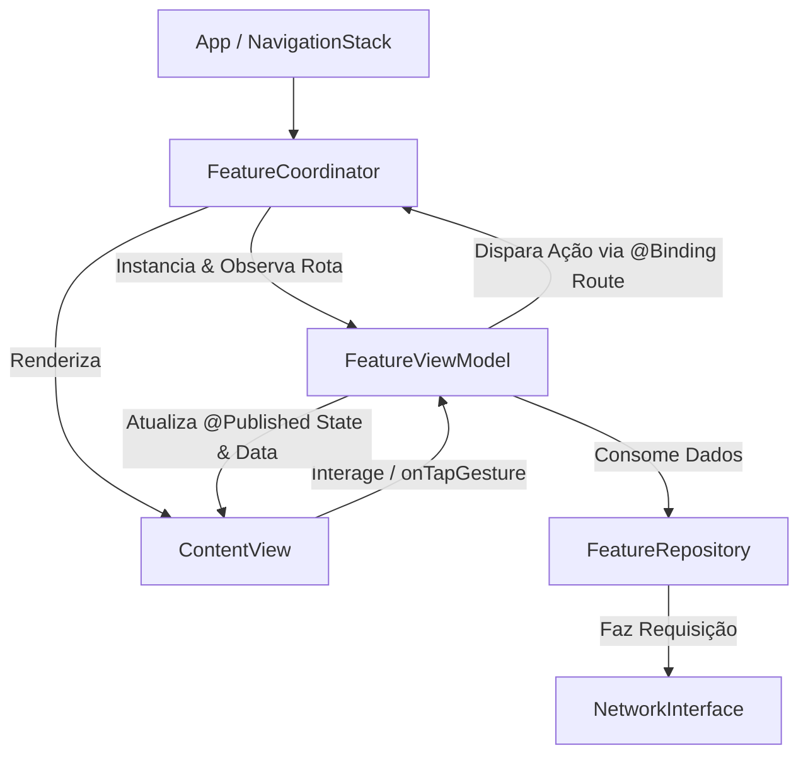
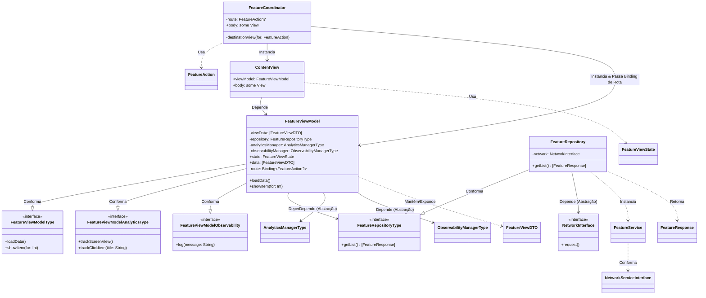

# Arquitetura do Módulo: MVVM-C com SwiftUI

Este documento explica o funcionamento da arquitetura aplicada no módulo `SomeFeature`, detalhando as responsabilidades de cada camada, o fluxo de navegação e o acoplamento entre os componentes.

---

## 🗺️ Visão Geral

A arquitetura adota o padrão **MVVM-C (Model-View-ViewModel-Coordinator)** adaptado de forma nativa e reativa para o **SwiftUI**. 

A principal premissa dessa implementação é a **descentralização da navegação da View**, mantendo-a puramente declarativa, enquanto o controle de rotas fica sob responsabilidade do **Coordinator** e a intenção de navegação parte do **ViewModel**.



---

## 🏢 Camadas da Arquitetura

### 1. Coordinator (`FeatureCoordinator.swift`)
O **Coordinator** é a View raiz do fluxo. Ele é responsável por:
*   Gerenciar o ciclo de navegação utilizando um `NavigationStack`.
*   Manter o estado da rota ativa através de um `@State private var route: FeatureAction?`.
*   Definir os destinos de navegação via `.navigationDestination(item:)`.
*   Instanciar a `ContentView` injetando o seu respectivo `FeatureViewModel` (passando a rota como um `@Binding`).

### 2. View (`ContentView` / `FeatureView.swift`)
A **View** é uma estrutura puramente declarativa e visual que:
*   Observa as mudanças do ViewModel através de `@ObservedObject` (ou `@StateObject`).
*   Reage às alterações de estado (`FeatureViewState`), renderizando os estados de `.loading`, `.ready` (com os dados estruturados em DTOs) ou `.error`.
*   Não possui conhecimento sobre rotas, `NavigationStack`, Coordinator ou lógica de transição de telas.
*   Comunica intenções do usuário diretamente ao ViewModel (ex: `viewModel.showItem(for: index)`).

### 3. ViewModel (`FeatureViewModel.swift`)
O **ViewModel** é o cérebro da funcionalidade. Ele realiza:
*   A gerência de estados da View (`state`) e do conjunto de dados processados (`data`).
*   A comunicação com a camada de dados (`FeatureRepositoryType`) e mapeamento do modelo do serviço (`FeatureResponse`) para o modelo de apresentação da View (`FeatureViewDTO`).
*   A sinalização de navegação modificando a propriedade `@Binding var route: FeatureAction?`.
*   A segregação de interfaces por meio de protocolos específicos, garantindo baixo acoplamento e facilitando testes unitários:
    *   `FeatureViewModelType`: Ações de interface (carregar dados, clique em item).
    *   `FeatureViewModelAnalyticsType`: Rastreamento de métricas e analytics.
    *   `FeatureViewModelObservability`: Registro de logs e telemetria.

### 4. Repository & Service (`FeatureRepository.swift` / `FeatureService.swift`)
*   **Repository**: Abstrai a origem dos dados (Rede, Banco de dados local, etc.). Ele conforma ao protocolo `FeatureRepositoryType` e interage com a interface de rede genérica `NetworkInterface`.
*   **Service**: Configura os detalhes específicos de uma requisição HTTP (path, método, cabeçalhos, corpo) implementando `NetworkServiceInterface`.

### 5. Models & DTOs
*   `FeatureViewState`: Enum que define os estados visuais da View (`.loading`, `.ready`, `.error`).
*   `FeatureAction`: Enum que mapeia as possíveis rotas/ações de navegação do módulo.
*   `FeatureResponse`: Estrutura decodificável (`Decodable`) que representa o payload retornado pela API.
*   `FeatureViewDTO`: Objeto simples contendo apenas as propriedades formatadas que a View necessita para renderização (evitando acoplamento da View com o modelo de rede).

---

## 🔗 Diagrama de Acoplamento (Grafo de Dependências)

O diagrama abaixo ilustra o acoplamento entre os componentes do módulo. 
Note que as dependências principais apontam para **protocolos** (linhas tracejadas), respeitando o princípio de **Inversão de Dependência (DIP)** do SOLID.



---

## 🔄 Fluxo de Navegação (Sem Acoplamento na View)

Abaixo está o detalhamento de como a navegação ocorre sem que a View saiba da existência do Coordinator ou de rotas específicas:

1. A **View** detecta a interação do usuário e invoca `viewModel.showItem(for: index)`.
2. O **ViewModel** processa o índice, identifica a ação necessária (ex: abrir a Tela 1) e atualiza a propriedade de rota:
   ```swift
   self.route = .openScreen1
   ```
3. Como `route` é um `@Binding` conectado ao `@State` do **Coordinator**, o Coordinator detecta a alteração.
4. O **Coordinator** reavalia o modificador `.navigationDestination(item: $route)` e executa a função de fábrica para instanciar a nova View de destino:
   ```swift
   private func destinationView(for action: FeatureAction) -> some View {
       switch action {
       case .openScreen1:
           Text("Screen 1")
       case .openScreen2:
           Text("Screen 2")
       }
   }
   ```
5. O SwiftUI empilha a nova View no `NavigationStack`.
